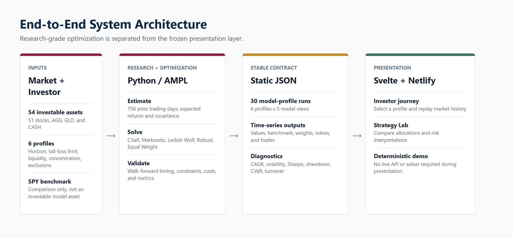
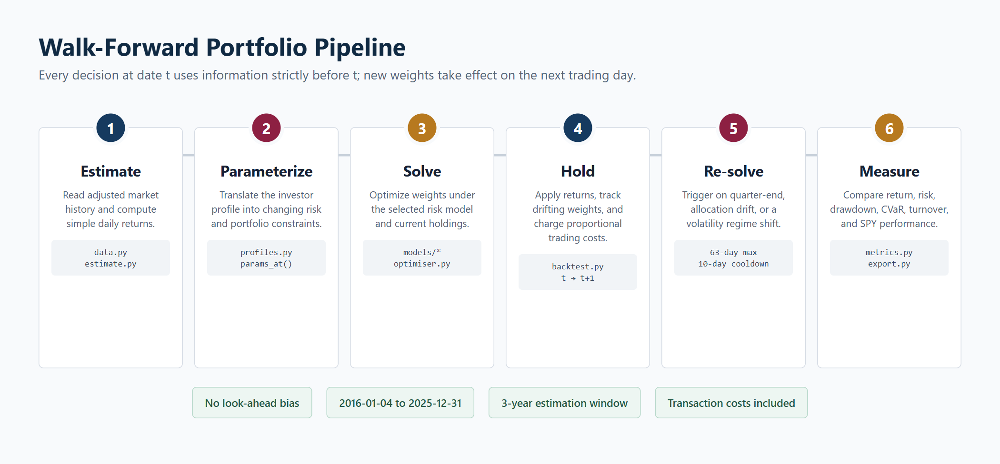

# Final Architecture





The repository intentionally contains two related but separate layers:

```text
Research layer: implementation/
  prices/returns -> validated windows -> model adapters -> metrics/tests

Presentation layer: frozen production pipeline
  data/processed + src/portfolio + model -> site/static/data/*.json
                                      -> site Svelte UI -> Netlify
```

The presentation layer is the final source of truth for the live demo. Its
five displayed models are CVaR, Markowitz, Markowitz + Ledoit-Wolf, robust
mean-variance, and equal weight. Its six profiles and static JSON files are
kept unchanged from the final presentation release.

The research layer is included for transparency and reproducibility. It uses
CVXPY adapters and a shared walk-forward backtester, but it is not wired into
the live page. In particular, the research `implementation/models/robust_mvo.py`
and the frozen `model/robust.mod` are different implementations; they are not
combined or presented as identical results.

## Why keep the boundary?

Freezing the presentation inputs makes the demo deterministic and protects
the tested visual story. Keeping the research code separate lets the team
explain methodology, constraints, and validation without changing the
published figures at the last minute.
